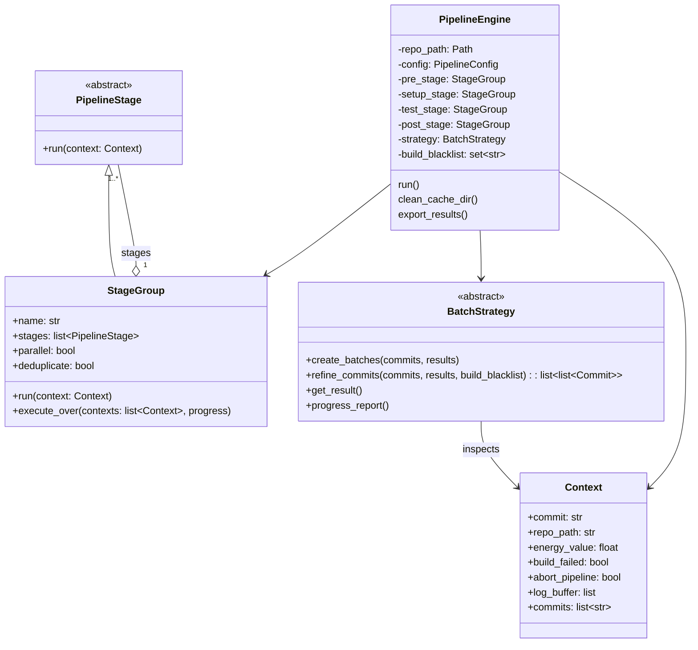

```mermaid
classDiagram

    %% ----------------
    %% Context (shared per commit/batch)
    class Context {
        +commit: str
        +repo_path: str
        +energy_value: float
        +build_failed: bool
        +abort_pipeline: bool
        +log_buffer: list
        +commits: list~str~
    }

    %% ----------------
    %% PipelineStage interface (composite base)

    class PipelineStage {
        <<abstract>>
        +run(context: Context)
    }

    %% StageGroup (composite of stages)
    class StageGroup {
        +name: str
        +stages: list~PipelineStage~
        +parallel: bool
        +deduplicate: bool
        +run(context: Context)
        +execute_over(contexts: list~Context~, progress)
    }
    PipelineStage <|-- StageGroup


    %% StageGroup contains atomic stages
    StageGroup "1" o-- "1..*" PipelineStage : stages


    %% ----------------
    %% Strategy Pattern
    class BatchStrategy {
        <<abstract>>
        +create_batches(commits, results)
        +refine_commits(commits, results, build_blacklist): list~list~Commit~~
        +get_result()
        +progress_report()
    }

    %% ----------------
    %% PipelineEngine orchestrates everything
    class PipelineEngine {
        -repo_path: Path
        -config: PipelineConfig
        -pre_stage: StageGroup
        -setup_stage: StageGroup
        -test_stage: StageGroup
        -post_stage: StageGroup
        -strategy: BatchStrategy
        -build_blacklist: set~str~
        run()
        clean_cache_dir()
        export_results()
    }
    PipelineEngine --> StageGroup
    PipelineEngine --> BatchStrategy
    PipelineEngine --> Context

    %% ----------------
    %% Relationships for strategy/context/results
    BatchStrategy --> Context : inspects

```