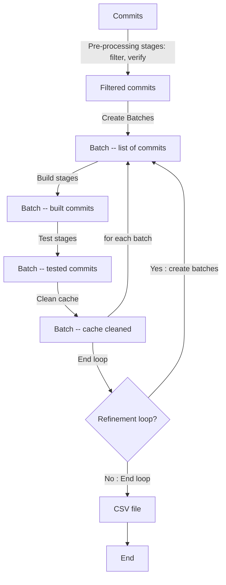

```mermaid
flowchart TD
    A[Commits]
    B[Filtered commits]
    C[Batch -- list of commits]
    D[Batch -- built commits]
    E[Batch -- tested commits]
    F[Batch -- cache cleaned]
    G{Refinement loop?}
    H[CSV file]
    I[End]

    %% Main linear path
    A -->|Pre-processing stages: filter, verify| B
    B -->|Create Batches| C

    %% Loop path for refinement
    C --> |Build stages|D
    D --> |Test stages|E
    F --> |for each batch|C
    G -->|Yes : create batches| C
    G -->|No : End loop| H
    E -->|Clean cache| F
    F -->|End loop| G
    H --> I
```